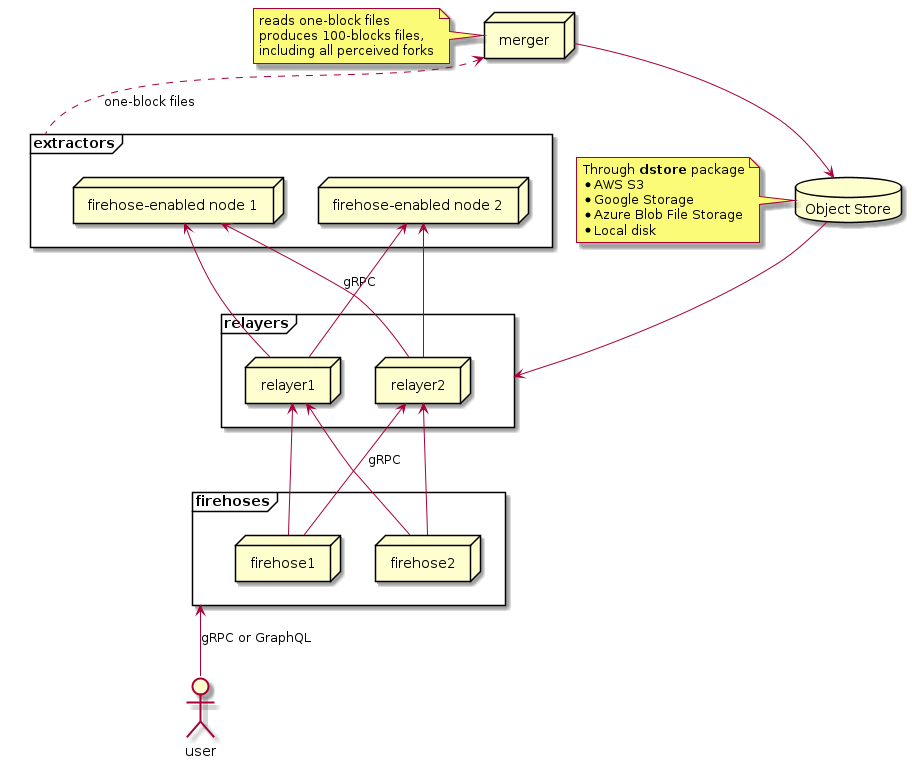

# Data Flow

## Data Flow in Firehose

### Data Flow in Detail

The path and process of how data flows through the Firehose component family are important facets to understand when using the application.

Blockchain data flows from instrumented nodes to the gRPC server through the Firehose [component family](components/).

### Data Flows Through Components

Each Firehose component plays an important role as the blockchain data flows through it.



### Data Flow Component Relationship

The StreamingFast Instrumentation feeds to Reader components. The Reader components feed the Relayer component.

The Index and IndexProvider components work with data provided by the instrumentation through the Reader through the Relayer. Finally, the Firehose gRPC Server component hands data back to any consumers of Firehose.

### Key Points

* An instrumented version of the native blockchain node process streams pieces of block data in a custom StreamingFast text-based protocol.
* Firehose Reader components read data streams from instrumented blockchain nodes.
* Reader components will then write the data to persistent storage. The data is then broadcast to the rest of the components in Firehose.
* The Relayer component reads block data provided by one or more Reader components and provides a live data source for the other Firehose components.
* The Merger component combines blocks created by Reader components into batches of one hundred individually merged blocks. The merged blocks are stored in an object store or written to disk.
* The Indexer component provides a targeted summary of the contents of each 100-blocks file that was created by the Merger component. The indexed 100-blocks files are tracked and cataloged in an index file created by the Indexer component.
* The IndexProvider component reads index files created by the Indexer component and provides fast responses about the contents of block data for filtering purposes.
* The Firehose gRPC server component receives blocks from either:
  * a merged blocks file source.
  * live block data received through the Relayer component.
  * an indexed file source created through the collaboration between the Indexer and IndexProvider components.
* The Firehose gRPC Server component then joins and returns the block data to its consumers.
* _Tradeoffs and benefits are presented for how data is stored and how it flows from the instrumented blockchain nodes through Firehose._

## Reader Data Flow

### Firehose Instrumentation

Firehose begins at the instrumentation conducted on nodes for targeted blockchains.

The instrumentation itself is called Firehose Instrumentation and generate Firehose Logs. Firehose instrumentation is an augmentation to the target blockchain node's source code. The instrumentation is placed within the node where blockchain state synchronization happen, when the chain receives block from the P2P network and execute the transactions it contains locally to update its internal global state.

### Firehose Logs

Firehose logs use a simple, unified text-based protocol over the operating system's standard output pipe. This protocol is **chain-agnostic** — any blockchain that implements the Firehose Logs specification automatically benefits from the entire Firehose ecosystem.

The protocol consists of just two message types that the instrumented node outputs to stdout.


For a reference implementation of Firehose instrumentation, see the [dummy-blockchain](https://github.com/streamingfast/dummy-blockchain) project. It demonstrates how to implement the protocol in a simple, educational blockchain node.


### Firehose Logs Protocol

The Firehose Logs protocol is intentionally simple, consisting of only two messages:

#### FIRE INIT

The initialization message is sent once at startup to declare the protocol version and the protobuf type used for blocks:

```
FIRE INIT <version> <protobuf_block_type>
```

| Field | Description |
|-------|-------------|
| `version` | Protocol version. Supported: `1.0`, `3.0`, `3.1` |
| `protobuf_block_type` | Fully qualified protobuf message name (e.g., `sf.acme.type.v1.Block`) |

#### FIRE BLOCK

Block messages are sent for each block, containing metadata and the full block payload:

**Protocol version 1.0/3.0:**
```
FIRE BLOCK <block_num> <block_hash> <parent_num> <parent_hash> <lib_num> <timestamp_nanos> <base64_block>
```

**Protocol version 3.1 (with partial block support):**
```
FIRE BLOCK <block_num> <partial_idx> <block_hash> <parent_num> <parent_hash> <lib_num> <timestamp_nanos> <base64_block>
```

| Field | Description |
|-------|-------------|
| `block_num` | Block height/number (uint64) |
| `partial_idx` | (v3.1 only) Partial block index. Values ≥1000 indicate final partial (actual index = value - 1000) |
| `block_hash` | Block identifier/hash |
| `parent_num` | Parent block number (uint64) |
| `parent_hash` | Parent block hash |
| `lib_num` | Last irreversible block number (uint64) |
| `timestamp_nanos` | Block timestamp in Unix nanoseconds |
| `base64_block` | Base64-encoded protobuf block payload |

### Example Firehose Logs

Example output from an instrumented blockchain node:

```shell
FIRE INIT 3.0 sf.acme.type.v1.Block
FIRE BLOCK 1 4e07408562bedb8b60ce05c1decfe3ad16b72230967de01f640b7e4729b49fce 0 0000000000000000000000000000000000000000000000000000000000000000 0 1609459200000000000 CgRhY21lEg...
FIRE BLOCK 2 4b227777d4dd1fc61c6f884f48641d02b4d121d3fd328cb08b5531fcacdabf8a 1 4e07408562bedb8b60ce05c1decfe3ad16b72230967de01f640b7e4729b49fce 0 1609459201000000000 CgRhY21lEg...
FIRE BLOCK 3 ef2d127de37b942baad06145e54b0c619a1f22327b2ebbcfbec78f5564afe39d 2 4b227777d4dd1fc61c6f884f48641d02b4d121d3fd328cb08b5531fcacdabf8a 1 1609459202000000000 CgRhY21lEg...
```

The `base64_block` field contains the chain-specific block data serialized as protobuf and encoded in base64. The protobuf schema can model any blockchain's data structures while maintaining compatibility with the Firehose ecosystem.

### Firehose Logs & Reader Coordination

The Firehose logs messages are read and processed by the Reader component from `firehose-core`.

The `reader` component:

* Launches the instrumented native node process and manages its lifecycle (start/stop/monitor)
* Connects to the native node process' standard output pipe
* Parses `FIRE INIT` to learn the protocol version and block type
* Parses each `FIRE BLOCK` message, decodes the base64 payload, and wraps it in a Firehose block envelope

After a block has been received, it is stored in persistent storage and simultaneously broadcast to all gRPC streaming subscribers. The persistent blocks enable historical access to all data in the blockchain without reliance on native node processes.

The easily accessible block data enables StreamingFast's highly parallelized reprocessing tools to read and manipulate different sections of the chain at the developer's convenience.

## Relayer Data Flow

### Relayer Data Flow in Detail

The Relayer component is responsible for connecting to one or more Reader components and receiving live block data from them.

### Multiple Relayer Connections

The Relayer component uses multiple connections to provide data redundancy for scenarios where Reader components have crashed or require maintenance. The Relayer also deduplicates incoming blocks resulting in speeds that match the fastest Reader available to read data from.

### Racing Relayer Data

The design of the Relayer component enables them to race to push data to consumers.

### Live Data Through Relayer

The Relayer component can function as a live data source for blocks in Firehose.

### Relayer & Reader Overlap

Relayer components serve the same interface as Reader components in simple setups without the need for high availability.

## Merger Data Flow

### Merger Data Flow in Detail

Merger components create bundles containing one hundred blocks per bundle. The Merger component utilizes persisted one-block files to create the one hundred blocks bundle.

### Merger Data Flow Responsibilities

The Merger component assists with the reduction of storage costs, improved data compression, and more efficient metered network access to single 100 blocks bundles.

### Historical Data Access

The blocks bundled by the Merger component become the file-based historical data source of blocks for all Firehose components.

## Indexer Data Flow

### Indexer Data Flow in Detail

The Indexer component runs as a background process digesting merged block files.

The Indexer component consumes merged blocks files and provides a targeted summary of the blocks. The targeted summaries are written to object storage as index files.

### Transforms

Target summaries are created when incoming Firehose queries contain StreamingFast Transforms.


**Note**_: Targeted summaries are variable in nature._


### Transforms & Protocol Buffers

StreamingFast Transforms are used to locate a specific series of blocks according to search criteria provided by Firehose consumers. Transforms are created using Protocol Buffer definitions.

## IndexProvider Data Flow

### IndexProvider Data Flow in Detail

The IndexProvider component accepts queries made to Firehose that contain StreamingFast Transforms.

### Chain Agnostic

The IndexProvider component is not specific to any particular blockchain's data format. The IndexProvider can be considered chain-agnostic for this reason.

### IndexProvider & Transforms

The IndexProvider component interprets Transforms in accordance with their Protocol Buffer definitions.

### Data Filtering

The Transforms are handed off to chain-specific filter functions. The desired filtering is applied to the blocks in the data stream by the IndexProvider component to limit the results it supplies.

### Specific Data in Large Ranges

The IndexProvider component using Transforms is able to provide knowledge about specific data in large ranges of block data. This includes the presence or absence of specific data contained within the blocks the component is filtering.

## gRPC Server Data Flow

### gRPC Server Data Flow in Detail

The gRPC Server component is responsible for supplying the stream of block data to requesting consumers of Firehose. The gRPC Server can be thought of as the top most component in the Firehose architectural stack.

### Persistent & Live Data

Firehose gRPC Server components connect to persisted and live block data sources to serve consumer data requests.


_Firehose was designed to switch between the persistent and live data store as it's joining data to intelligently fulfill inbound requests from consumers._


### Historical Data Requests

Consumer requests for historical blocks are fetched from persistent storage. The historical blocks are passed inside a `ForkDB` and sent with a cursor uniquely identifying the block and its position in the blockchain.

### Fork Preservation

Firehose has the ability to resume from forked blocks because all forks are preserved during node data processing.

### gRPC Data Filtering

The gRPC component will filter block content through Transforms passed to the IndexProvider component. The Transforms are used as filter expressions to isolate specific data points in the block data.

Transactions that do not match the filter criteria provided in Transforms are removed from the block and execution units are flagged as either matching or not matching.

Block metadata is always sent to guarantee sequentiality on the receiving end; with or without matching Transforms criteria.

## `bstream`

### bstream in Detail

The StreamingFast bstream package manages flows of blocks and forks in a blockchain through a handler-based interface, similar to Go's net/http package.

### bstream Orchestration

The bstream package is responsible for collaboration between all other Firehose components.

The bstream package abstracts details surrounding files and block streaming from instrumented blockchain nodes.


**Tip**_: The bstream package presents an extremely powerful and simplified interface for dealing will all blockchain reorganizations._


### bstream Design & Motivation

StreamingFast built, refined, and enhanced the bstream package over the period of several years. Key design considerations for bstream included high speed for data transfers and fast data throughput. Capabilities include downloading multiple files in parallel, decoding multiple blocks in parallel, and inline filtering.

### bstream & ForkDB

An extremely important element of proper blockchain linearity is the StreamingFast `ForkDB.` The `bstream` package utilizes the `ForkDB` data structure for data storage.

### ForkDB in Detail

The `ForkDB` is a graph-based data structure that mimics the forking logic used by the native blockchain node.

`The ForkDB` receives all blocks and orders them based on the parent-child relationship defined by the chain. The ForkDB will keep around active forked branches and reorganizations that are occurring on-chain.

### ForkDB Events

When a block branch becomes the longest block chain, the `ForkDB` will switch to it. The `ForkDB` will emit a series of events for proper handling of forks for example `new 1b`, `new 2b`, `undo 2b`, `new 2a`, `new 3a`, etc.

### Active Forks

Active forks are kept until a certain level of confirmation is achieved or when blocks become final or irreversible. The exact rules for the confirmation can be configured for specific blockchains.

### ForkDB Irreversibility Events

Specific irreversibility events are emitted by the `ForkDB` instance.

Each event emitted by the ForkDB instance contains:

* the step’s type of `new`, `undo`, or `irreversible,`
* the block the step relates to,
* and a cursor.

### ForkDB Cursor

The ForkDB cursor points to a specific position in the stream of events emitted by `ForkDB` and the blockchain itself.

The ForkDB cursor contains information that is required to reconstruct an equivalent forked or canonical instance of the `ForkDB`.

### Start & Stop Event Streaming

The ForkDB is created in the correct branch, enabling the ability to perfectly resume the event streaming where the consumer last stopped.

### Chain-agnostic ForkDB

The `bstream` library is chain-agnostic, and is only concerned about the concept of a `Block`.

### bstream Metadata

The `bstream` library contains the minimally required metadata to maintain the consistency of the chain.

### Block & Protocol Buffers

`Block` carries a payload of Protocol Buffer bytes. The payload can be decoded by the consumer in accordance with one of the supported chain-specific `Block` definitions, for example, `sf.ethereum.type.v1.Block`.

## Substreams Data Flow

### Substreams Data Flow in Detail

The Substreams component provides parallel data transformation capabilities on top of the Firehose data pipeline. Substreams reads from the same data sources as other Firehose components and adds a powerful processing layer.

### Data Sources

Substreams consumes data from:

* **Merged Blocks Storage**: Historical block data processed by the Merger component
* **One-Block Storage**: Recent blocks not yet merged
* **Relayer**: Live blocks for real-time streaming

### Two-Tier Processing

Substreams uses a two-tier architecture to optimize processing:

* **Tier 1**: Handles request coordination, live block streaming (from Relayer), and merges results from Tier 2 workers
* **Tier 2**: Executes WASM modules against historical block ranges in parallel

### Execution Flow

1. Consumer sends a Substreams request with a `.spkg` package to Tier 1
2. For live blocks: Tier 1 executes modules directly using blocks from the Relayer
3. For historical blocks: Tier 1 dispatches block ranges to multiple Tier 2 instances
4. Tier 2 instances read blocks from merged block storage and execute WASM modules
5. Results are cached for future requests with the same modules and block ranges
6. Tier 1 merges all results and streams them back to the consumer

### Caching Strategy

Substreams caches execution results at module output boundaries. This enables:

* Fast subsequent requests for the same data
* Efficient composability where downstream modules reuse cached upstream outputs
* Reduced computational overhead for popular Substreams packages

### Data Storage in Detail

Understanding the storage mechanisms and methodologies used for data in Firehose is another important topic. Additional details on Firehose [data storage](data-storage.md) are provided in the documentation.
